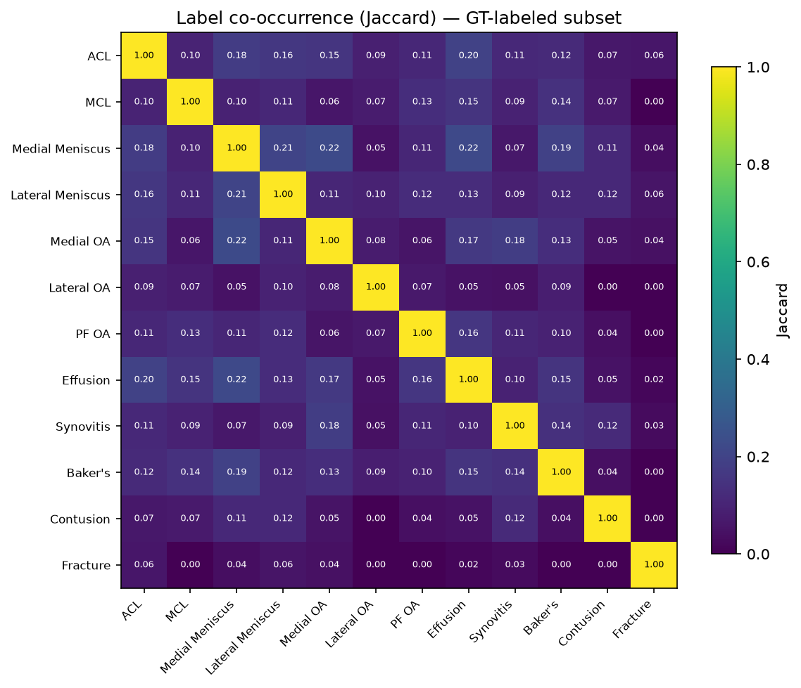
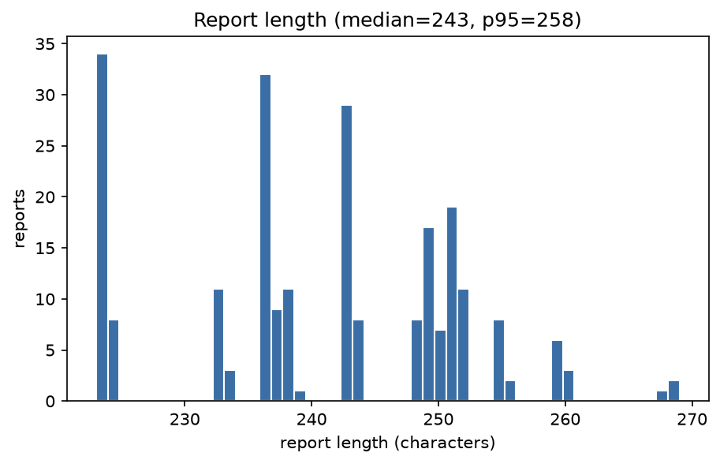
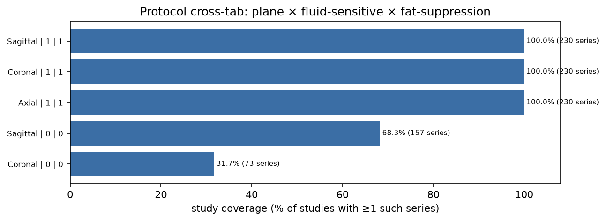
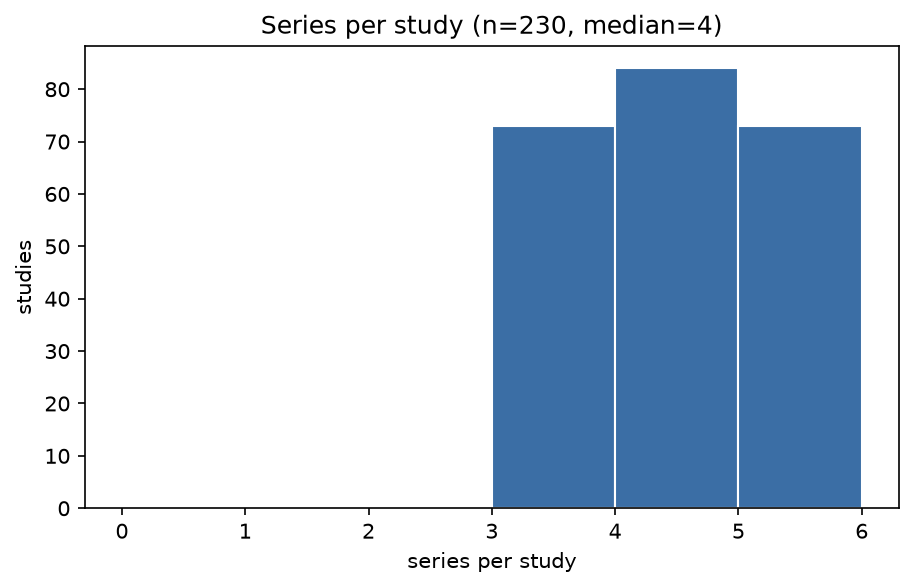

# EDA report — RSNA Knee Abnormality Detection

_Generated by `make eda` (`scripts/run_eda.py`). Deterministic: no timestamps — a rerun on unchanged data yields a byte-identical file._

- config hash: `d366f59f9900`
- git sha: `nogit`
- seed: `42`
- DICOM headers read: `230` (source: sweep; PatientID coverage 100.0%)

## 1. Label census (GT-labeled subset only)

| n_studies | n_labeled | n_partial | n_unlabeled |
|---|---|---|---|
| 230 | 172 | 0 | 58 |

### Per-label prevalence

| label | n_pos | n_neg | pos_rate |
|---|---|---|---|
| ACL | 48 | 124 | 0.2791 |
| MCL | 28 | 144 | 0.1628 |
| Medial Meniscus | 51 | 121 | 0.2965 |
| Lateral Meniscus | 31 | 141 | 0.1802 |
| Medial OA | 42 | 130 | 0.2442 |
| Lateral OA | 15 | 157 | 0.0872 |
| PF OA | 32 | 140 | 0.1860 |
| Effusion | 49 | 123 | 0.2849 |
| Synovitis | 30 | 142 | 0.1744 |
| Baker's | 36 | 136 | 0.2093 |
| Contusion | 17 | 155 | 0.0988 |
| Fracture | 6 | 166 | 0.0349 |

### **Rare/skewed labels**

| label | n_pos | n_neg | pos_rate | reason |
|---|---|---|---|---|
| Fracture | 6 | 166 | 0.0349 | pos_rate < 5% |

### Co-occurrence — Jaccard

|  | ACL | MCL | Medial Meniscus | Lateral Meniscus | Medial OA | Lateral OA | PF OA | Effusion | Synovitis | Baker's | Contusion | Fracture |
|---|---|---|---|---|---|---|---|---|---|---|---|---|
| ACL | 1.00 | 0.10 | 0.18 | 0.16 | 0.15 | 0.09 | 0.11 | 0.20 | 0.11 | 0.12 | 0.07 | 0.06 |
| MCL | 0.10 | 1.00 | 0.10 | 0.11 | 0.06 | 0.08 | 0.13 | 0.15 | 0.09 | 0.14 | 0.07 | 0.00 |
| Medial Meniscus | 0.18 | 0.10 | 1.00 | 0.21 | 0.22 | 0.05 | 0.11 | 0.22 | 0.07 | 0.19 | 0.11 | 0.04 |
| Lateral Meniscus | 0.16 | 0.11 | 0.21 | 1.00 | 0.11 | 0.10 | 0.12 | 0.13 | 0.09 | 0.12 | 0.12 | 0.06 |
| Medial OA | 0.15 | 0.06 | 0.22 | 0.11 | 1.00 | 0.08 | 0.06 | 0.17 | 0.18 | 0.13 | 0.05 | 0.04 |
| Lateral OA | 0.09 | 0.08 | 0.05 | 0.10 | 0.08 | 1.00 | 0.07 | 0.05 | 0.05 | 0.09 | 0.00 | 0.00 |
| PF OA | 0.11 | 0.13 | 0.11 | 0.12 | 0.06 | 0.07 | 1.00 | 0.16 | 0.11 | 0.10 | 0.04 | 0.00 |
| Effusion | 0.20 | 0.15 | 0.22 | 0.13 | 0.17 | 0.05 | 0.16 | 1.00 | 0.10 | 0.15 | 0.05 | 0.02 |
| Synovitis | 0.11 | 0.09 | 0.07 | 0.09 | 0.18 | 0.05 | 0.11 | 0.10 | 1.00 | 0.14 | 0.12 | 0.03 |
| Baker's | 0.12 | 0.14 | 0.19 | 0.12 | 0.13 | 0.09 | 0.10 | 0.15 | 0.14 | 1.00 | 0.04 | 0.00 |
| Contusion | 0.07 | 0.07 | 0.11 | 0.12 | 0.05 | 0.00 | 0.04 | 0.05 | 0.12 | 0.04 | 1.00 | 0.00 |
| Fracture | 0.06 | 0.00 | 0.04 | 0.06 | 0.04 | 0.00 | 0.00 | 0.02 | 0.03 | 0.00 | 0.00 | 1.00 |

### Co-occurrence — conditional P(row | col)

|  | ACL | MCL | Medial Meniscus | Lateral Meniscus | Medial OA | Lateral OA | PF OA | Effusion | Synovitis | Baker's | Contusion | Fracture |
|---|---|---|---|---|---|---|---|---|---|---|---|---|
| ACL | 1.00 | 0.25 | 0.29 | 0.35 | 0.29 | 0.33 | 0.25 | 0.33 | 0.27 | 0.25 | 0.24 | 0.50 |
| MCL | 0.15 | 1.00 | 0.14 | 0.19 | 0.10 | 0.20 | 0.22 | 0.20 | 0.17 | 0.22 | 0.18 | 0.00 |
| Medial Meniscus | 0.31 | 0.25 | 1.00 | 0.45 | 0.40 | 0.20 | 0.25 | 0.37 | 0.17 | 0.39 | 0.41 | 0.33 |
| Lateral Meniscus | 0.23 | 0.21 | 0.27 | 1.00 | 0.17 | 0.27 | 0.22 | 0.18 | 0.17 | 0.19 | 0.29 | 0.33 |
| Medial OA | 0.25 | 0.14 | 0.33 | 0.23 | 1.00 | 0.27 | 0.12 | 0.27 | 0.37 | 0.25 | 0.18 | 0.33 |
| Lateral OA | 0.10 | 0.11 | 0.06 | 0.13 | 0.10 | 1.00 | 0.09 | 0.06 | 0.07 | 0.11 | 0.00 | 0.00 |
| PF OA | 0.17 | 0.25 | 0.16 | 0.23 | 0.10 | 0.20 | 1.00 | 0.22 | 0.20 | 0.17 | 0.12 | 0.00 |
| Effusion | 0.33 | 0.36 | 0.35 | 0.29 | 0.31 | 0.20 | 0.34 | 1.00 | 0.23 | 0.31 | 0.18 | 0.17 |
| Synovitis | 0.17 | 0.18 | 0.10 | 0.16 | 0.26 | 0.13 | 0.19 | 0.14 | 1.00 | 0.22 | 0.29 | 0.17 |
| Baker's | 0.19 | 0.29 | 0.27 | 0.23 | 0.21 | 0.27 | 0.19 | 0.22 | 0.27 | 1.00 | 0.12 | 0.00 |
| Contusion | 0.08 | 0.11 | 0.14 | 0.16 | 0.07 | 0.00 | 0.06 | 0.06 | 0.17 | 0.06 | 1.00 | 0.00 |
| Fracture | 0.06 | 0.00 | 0.04 | 0.06 | 0.05 | 0.00 | 0.00 | 0.02 | 0.03 | 0.00 | 0.00 | 1.00 |

## 2. Report census

### Languages

| language | count | pct |
|---|---|---|
| es | 79 | 0.3435 |
| en | 76 | 0.3304 |
| fr | 75 | 0.3261 |

### Length distribution (feeds Spec 02 cost estimate)

| stat | chars | approx_tokens |
|---|---|---|
| p5 | 223.0 | 55.8 |
| p50 | 243.0 | 60.8 |
| p95 | 257.6 | 64.4 |
| max | 269.0 | 67.2 |
| mean | 240.8 | 60.2 |
| total | 55380.0 | 13845.0 |

### Structural sections

| language | n_reports | n_with_header | pct_with_header | pattern |
|---|---|---|---|---|
| es | 79 | 79 | 1.0000 | \b(?:HALLAZGOS|CONCLUSI[OÓ]N|T[EÉ]CNICA|IMPRESI[OÓ]N)\b |
| en | 76 | 76 | 1.0000 | \b(?:FINDINGS|IMPRESSION|CONCLUSION|TECHNIQUE|COMPARISON|HISTORY)\b |
| fr | 75 | 75 | 1.0000 | \b(?:R[EÉ]SULTATS?|CONCLUSION|TECHNIQUE|INDICATION|COMPARAISON)\b |

### Duplicate reports

| kind | n_clusters | n_studies_in_clusters | largest_cluster |
|---|---|---|---|
| exact | 22 | 228 | 34 |
| near | 22 | 228 | 34 |

Largest near-duplicate clusters:

| cluster_size | example_uid | example_chars |
|---|---|---|
| 34 | 1.2.826.0.1.1000006 | 223 |
| 32 | 1.2.826.0.1.1000003 | 236 |
| 29 | 1.2.826.0.1.1000001 | 243 |
| 14 | 1.2.826.0.1.1000036 | 249 |
| 11 | 1.2.826.0.1.1000009 | 233 |
| 11 | 1.2.826.0.1.1000017 | 238 |
| 10 | 1.2.826.0.1.1000010 | 251 |
| 9 | 1.2.826.0.1.1000035 | 237 |
| 9 | 1.2.826.0.1.1000000 | 251 |
| 8 | 1.2.826.0.1.1000048 | 248 |
| 8 | 1.2.826.0.1.1000012 | 244 |
| 8 | 1.2.826.0.1.1000039 | 224 |
| 8 | 1.2.826.0.1.1000005 | 255 |
| 8 | 1.2.826.0.1.1000032 | 252 |
| 7 | 1.2.826.0.1.1000004 | 250 |

## 3. Series census

### Series per study

| stat | value |
|---|---|
| n_studies | 230.00 |
| p5 | 3.00 |
| p50 | 4.00 |
| p95 | 5.00 |
| min | 3.00 |
| max | 5.00 |
| mean | 4.00 |

### Protocol cross-tab (plane × fluid × fat-sat)

| Anatomical_Plane | Fluid_Sensitive | Fat_Suppression | n_series | n_studies | study_coverage | series_per_covered_study |
|---|---|---|---|---|---|---|
| Axial | 1 | 1 | 230 | 230 | 1.0000 | 1.0000 |
| Coronal | 1 | 1 | 230 | 230 | 1.0000 | 1.0000 |
| Sagittal | 1 | 1 | 230 | 230 | 1.0000 | 1.0000 |
| Sagittal | 0 | 0 | 157 | 157 | 0.6826 | 1.0000 |
| Coronal | 0 | 0 | 73 | 73 | 0.3174 | 1.0000 |

### **Canonical protocol table** — routing input for Spec 03 Task 3.3

| Anatomical_Plane | Fluid_Sensitive | Fat_Suppression | n_series | n_studies | study_coverage | series_per_covered_study |
|---|---|---|---|---|---|---|
| Axial | 1 | 1 | 230 | 230 | 1.0000 | 1.0000 |
| Coronal | 1 | 1 | 230 | 230 | 1.0000 | 1.0000 |
| Sagittal | 1 | 1 | 230 | 230 | 1.0000 | 1.0000 |
| Sagittal | 0 | 0 | 157 | 157 | 0.6826 | 1.0000 |
| Coronal | 0 | 0 | 73 | 73 | 0.3174 | 1.0000 |

### Plane coverage (predicts routing fallback rate)

| plane | studies_any | studies_fluid | studies_fatsat_fluid | coverage_any | coverage_fluid | coverage_fatsat_fluid |
|---|---|---|---|---|---|---|
| Axial | 230 | 230 | 230 | 1.0000 | 1.0000 | 1.0000 |
| Coronal | 230 | 230 | 230 | 1.0000 | 1.0000 | 1.0000 |
| Sagittal | 230 | 230 | 230 | 1.0000 | 1.0000 | 1.0000 |

### Sampled DICOM headers

Numeric fields:

| field | n | p5 | p50 | p95 | min | max |
|---|---|---|---|---|---|---|
| n_files | 230 | 1.000 | 1.000 | 1.000 | 1.000 | 1.000 |
| rows | 230 | 256.000 | 256.000 | 256.000 | 256.000 | 256.000 |
| cols | 230 | 256.000 | 256.000 | 256.000 | 256.000 | 256.000 |
| pixel_spacing_y | 230 | 0.270 | 0.310 | 0.350 | 0.270 | 0.350 |
| pixel_spacing_x | 230 | 0.270 | 0.310 | 0.350 | 0.270 | 0.350 |
| slice_thickness | 230 | 3.000 | 3.000 | 3.000 | 3.000 | 3.000 |

Transfer syntaxes:

| transfer_syntax | count |
|---|---|
| 1.2.840.10008.1.2.1 | 230 |

Manufacturer:

| Manufacturer | count |
|---|---|
| SIEMENS | 79 |
| GE MEDICAL SYSTEMS | 77 |
| Philips | 74 |

Model:

| ManufacturerModelName | count |
|---|---|
| MAGNETOM Aera | 79 |
| SIGNA HDxt | 77 |
| Ingenia | 74 |

Field strength:

| MagneticFieldStrength | count |
|---|---|
| 1.5 | 153 |
| 3.0 | 77 |

In-plane shapes:

| shape | count |
|---|---|
| 256x256 | 230 |

## 4. Site clustering

Studies whose site cluster comes from a DICOM fingerprint: 100.0% (rest use the protocol-signature fallback).

### Cluster sizes

| site_cluster | n_studies | fingerprint |
|---|---|---|
| 2 | 79 | SIEMENS|MAGNETOM Aera|1.5|0.31|PYDICOM_TEST |
| 0 | 77 | GE MEDICAL SYSTEMS|SIGNA HDxt|3.0|0.27|PYDICOM_TEST |
| 1 | 74 | Philips|Ingenia|1.5|0.35|PYDICOM_TEST |

### Per-cluster label prevalence

| site_cluster | n_studies | ACL | MCL | Medial Meniscus | Lateral Meniscus | Medial OA | Lateral OA | PF OA | Effusion | Synovitis | Baker's | Contusion | Fracture |
|---|---|---|---|---|---|---|---|---|---|---|---|---|---|
| 0 | 58 | 0.293 | 0.207 | 0.345 | 0.172 | 0.293 | 0.086 | 0.138 | 0.276 | 0.190 | 0.207 | 0.103 | 0.017 |
| 1 | 53 | 0.264 | 0.151 | 0.358 | 0.226 | 0.151 | 0.075 | 0.189 | 0.283 | 0.208 | 0.113 | 0.151 | 0.038 |
| 2 | 61 | 0.279 | 0.131 | 0.197 | 0.148 | 0.279 | 0.098 | 0.230 | 0.295 | 0.131 | 0.295 | 0.049 | 0.049 |
| global | 172 | 0.279 | 0.163 | 0.297 | 0.180 | 0.244 | 0.087 | 0.186 | 0.285 | 0.174 | 0.209 | 0.099 | 0.035 |

### **Site–label confounds**

| site_cluster | label | cluster_rate | global_rate | ratio | n_studies |
|---|---|---|---|---|---|
| 2 | Contusion | 0.049 | 0.099 | 0.498 | 61 |
| 0 | Fracture | 0.017 | 0.035 | 0.494 | 58 |

## 5. Top 5 risks observed

- **Rare/skewed labels** — Fracture (3.5%). Expect unstable per-label AUC; these drive the Spec 04 §4.4 rare-label program and the ±25% fold-balance test.
- **Site–label confounds** — 2 cluster×label pairs deviate >2× from global (worst: cluster 2 / Contusion, ratio 0.50). Model may learn the scanner; check per-cluster AUC.
- **Template/duplicate reports** — 228 studies in 22 near-duplicate clusters (largest 34). Identical LLM labels for these; leakage risk if they straddle folds.
- **Label scarcity** — only 74.8% of studies carry ground truth (172/230). Spec 02 label quality upper-bounds everything downstream.

_Free-text additions from human review go below this line._

